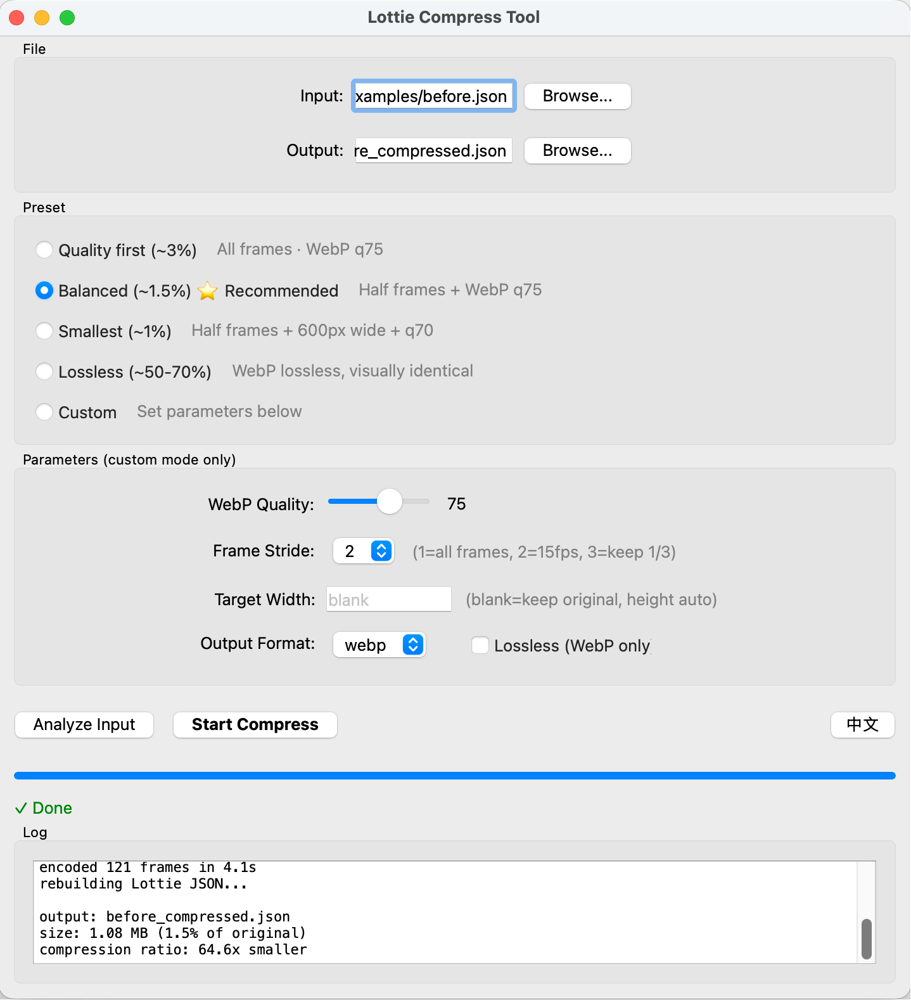
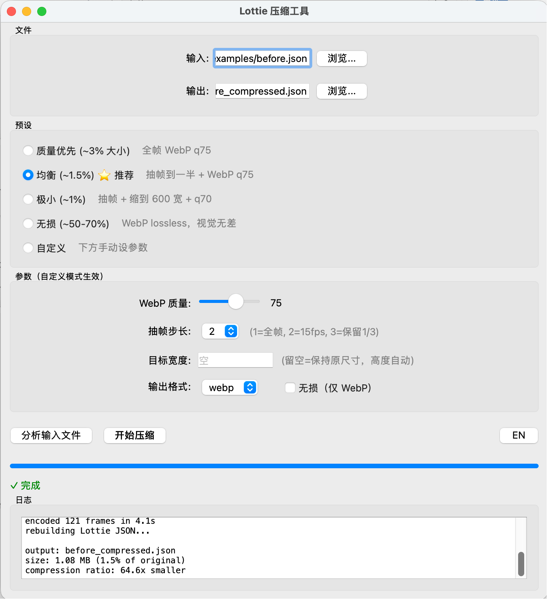
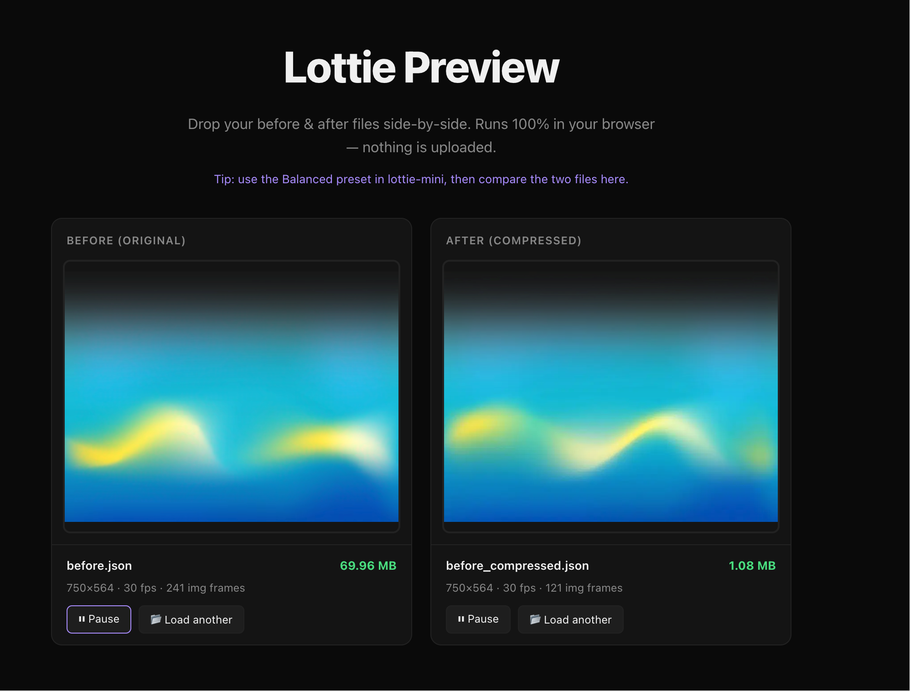
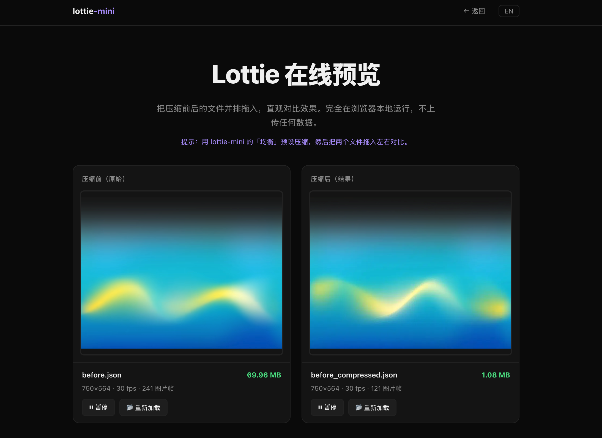

# lottie-mini

**Compress image-sequence Lottie files by 50–100×, with a desktop GUI.**

[](https://lottie-mini.vercel.app)
[](https://lottie-mini.vercel.app/preview)

> **🌐 Landing page:** https://lottie-mini.vercel.app
> **🎬 Lottie Preview Tool:** https://lottie-mini.vercel.app/preview

[中文说明](#中文说明) · [Install](#installation)

---

**GUI — English / 中文 toggle built in:**

| English | 中文 |
|---------|------|
|  |  |

**Live preview tool ([lottie-mini.vercel.app/preview](https://lottie-mini.vercel.app/preview)):**

| Before vs After | 压缩前后对比 |
|----------------|-------------|
|  |  |

## What it does

Lottie files that embed PNG frame sequences can balloon to 30–100 MB. `lottie-mini` re-encodes every frame to WebP (with optional frame-skipping and resize), then rewrites the timeline — shrinking those files to under 1 MB while remaining visually indistinguishable.

| File | Before | After (Balanced) | Ratio |
|------|--------|-----------------|-------|
| Sample animation | 70 MB | 1.1 MB | **64×** |

> Only works on Lottie files with **embedded image frames** (base64 PNG/JPEG).  
> Vector-only Lottie files are already tiny — this tool won't help them.

---

## Features

- **Desktop GUI** — PyQt6 window, no terminal needed
- **Smart frame skipping** — halve the frame count at 15 fps with no perceived motion loss
- **WebP encoding** — Pillow's `method=2` encodes fast while avoiding the alpha-channel bug in lossless mode
- **4 presets** — Quality / Balanced ⭐ / Smallest / Lossless
- **Custom mode** — tweak quality, stride, target width, and output format (WebP or PNG)
- **Timeline rewrite** — correctly patches `ip`/`op`/`st` on sequence layers after frame skipping
- **Offline / private** — runs entirely on your machine, no uploads

---

## Installation

Requires Python 3.10+.

```bash
# 1. Clone
git clone https://github.com/Alex92908/lottie-mini.git
cd lottie-mini

# 2. Install dependencies
pip install -r requirements.txt

# 3. Run GUI
python compress_lottie_qt.py
```

Or just copy `compress_lottie_qt.py` and `requirements.txt` into any folder — there's nothing else needed.

---

## Presets

| Preset | Frame skip | WebP quality | Resize | Typical ratio |
|--------|-----------|-------------|--------|--------------|
| Quality first | none | 75 | — | ~3% of original |
| **Balanced ⭐** | every 2nd | 75 | — | ~1.5% |
| Smallest | every 2nd | 70 | 600 px wide | ~1% |
| Lossless | none | — | — | ~50–70% |
| Custom | user-set | user-set | user-set | — |

---

## Platform compatibility

| Runtime | WebP support |
|---------|-------------|
| lottie-web (browser) | ✅ |
| lottie-ios 4.x+ | ✅ |
| lottie-android 4.x+ | ✅ |
| Mini-programs / older SDKs | use PNG output |

---

## Requirements

```
pillow>=10.0.0
PyQt6>=6.5.0
```

---

## License

MIT

---

## 中文说明

把内嵌 PNG 帧序列的 Lottie 文件压缩 50–100 倍，带桌面 GUI。

> **🌐 项目主页：** https://lottie-mini.vercel.app
> **🎬 在线预览工具：** https://lottie-mini.vercel.app/preview

**安装和运行：**

```bash
git clone https://github.com/Alex92908/lottie-mini.git
cd lottie-mini
pip install -r requirements.txt
python compress_lottie_qt.py
```

详细操作指南见 [docs/manual_zh.md](docs/manual_zh.md)。

**原理：**  
将每一帧 PNG 重新编码为 WebP（可选抽帧 + 缩放），同时修正时间轴的 `ip`/`op`/`st` 字段，保证抽帧后动画时长不变。

**适用范围：** 仅对「内嵌 base64 图片帧」的 Lottie 有效。纯矢量 Lottie 本身已经很小，无需使用本工具。
